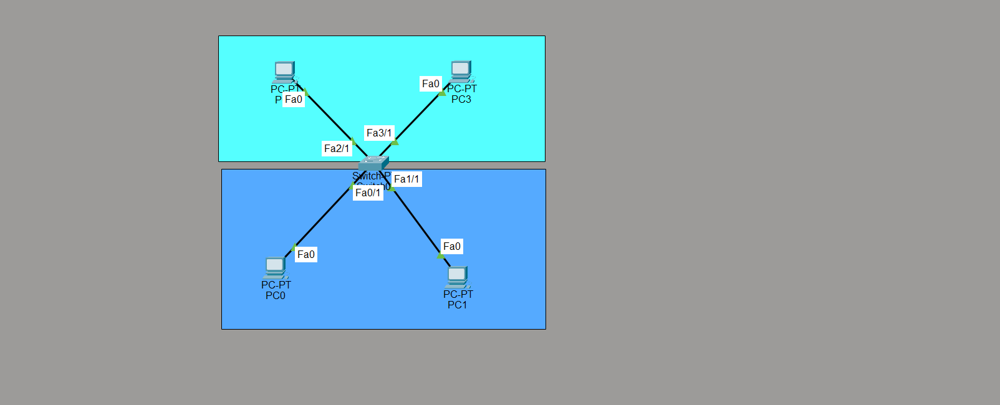
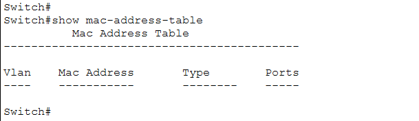
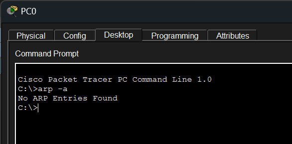
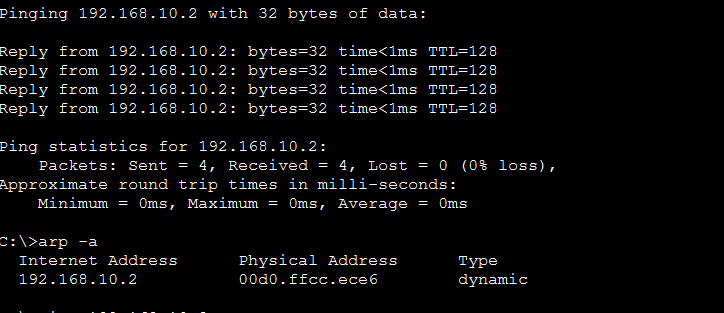
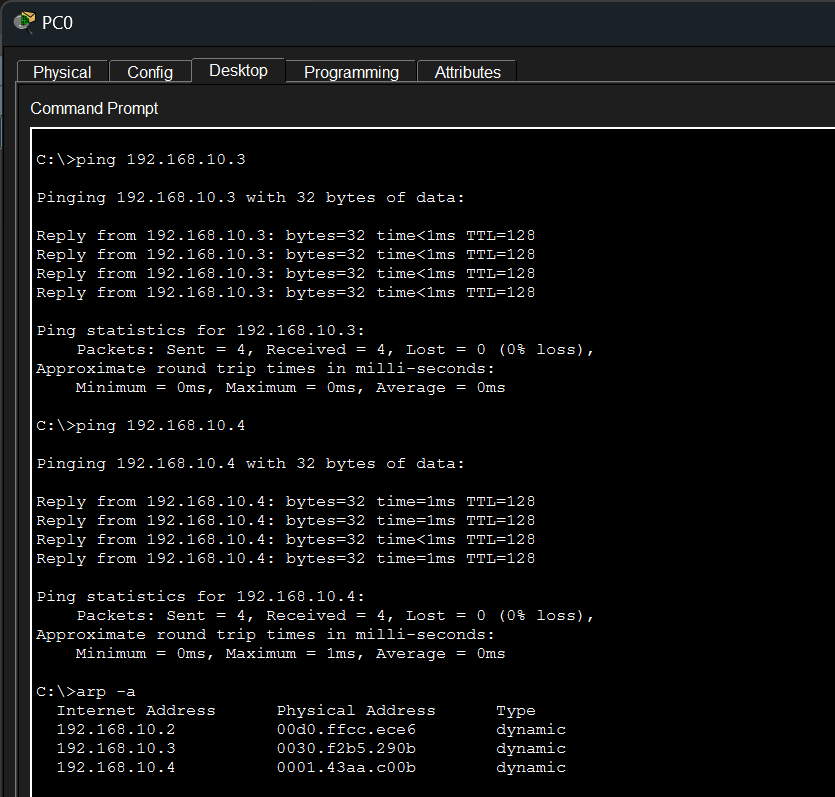
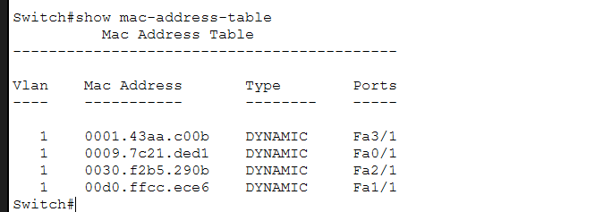
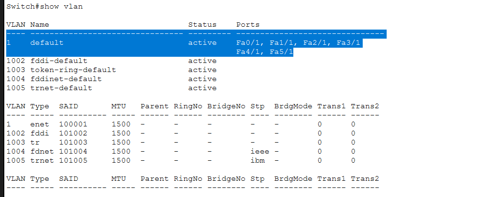
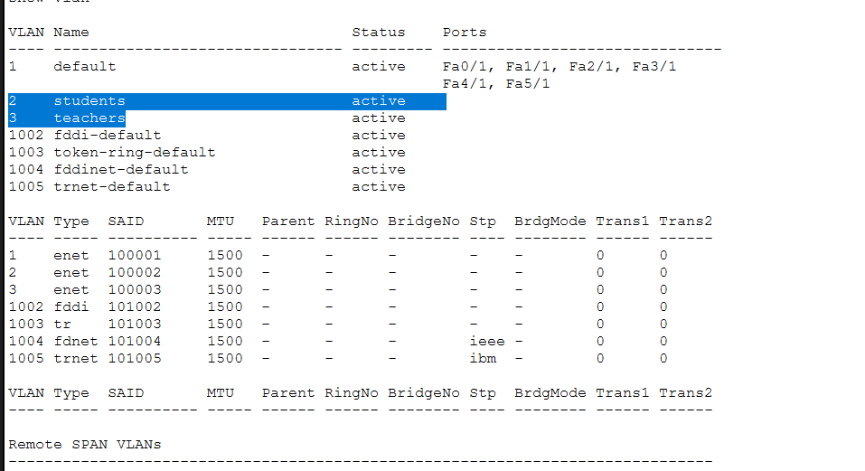
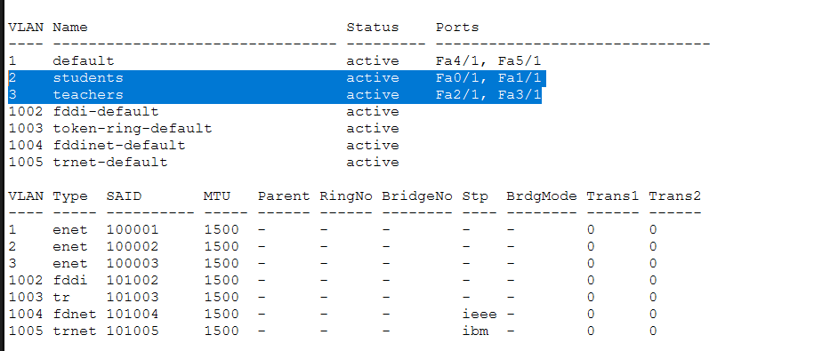
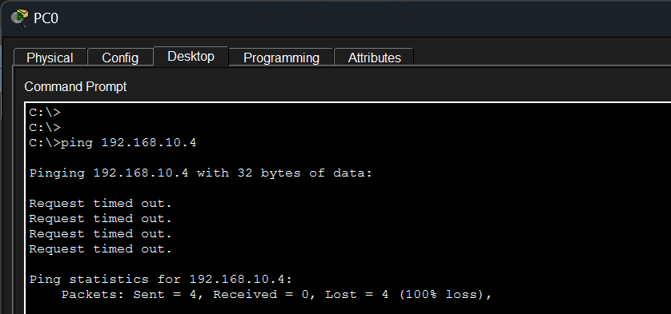

# VLAN Segmentation & MAC/ARP Fundamentals

A single-switch lab demonstrating how a switch builds its MAC address table, how hosts build their ARP cache, and how VLANs create separate broadcast domains on the same physical switch — verified by showing that a ping between two VLANs fails even though all hosts share the same IP subnet.

## Objectives

- Observe the MAC address table and ARP cache in their empty (default) state
- Watch both tables populate dynamically as a result of normal ping traffic
- Confirm the default VLAN (VLAN 1) behavior — all ports assigned to it out of the box
- Create custom VLANs and reassign switch ports to them
- Prove that VLANs are separate broadcast domains by showing inter-VLAN ping failure

## Topology



1 switch, 4 PCs (PC0–PC3), all connected via access ports on the same switch.

## IP Addressing Table

| Device | IP Address       | Switch Port | VLAN (after segmentation) |
|--------|-------------------|-------------|----------------------------|
| PC0    | 192.168.10.1*     | Fa0/1       | 2 — students                |
| PC1    | 192.168.10.2      | Fa1/1       | 2 — students                |
| PC2    | 192.168.10.3      | Fa2/1       | 3 — teachers                |
| PC3    | 192.168.10.4      | Fa3/1       | 3 — teachers                |

\*PC0's own IP was not captured in a screenshot — confirm and update if different.

All four hosts sit in the same `192.168.10.0/24` subnet. This is intentional: it isolates VLAN behavior as the *only* variable causing the final ping failure, rather than a routing/subnet mismatch.

## Part 1 — Empty State

Before any traffic is generated, both the switch's MAC address table and PC0's ARP cache are empty.

**Switch MAC address table — empty:**


**PC0 ARP cache — empty:**


## Part 2 — Building the ARP Cache and MAC Table

PC0 pings PC1 (192.168.10.2). Since PC0 has no ARP entry for that IP, it broadcasts an ARP request ("who has 192.168.10.2?"). PC1 replies with its MAC address, which PC0 caches before sending the actual ICMP echo request.



PC0 then pings PC2 and PC3 as well, repeating the same ARP resolution process for each new destination. All three entries are now cached:



Meanwhile, the switch learned each device's **source MAC address** and the **port it arrived on** for every frame that crossed it — populating its MAC address table:



| VLAN | MAC Address     | Port  |
|------|-----------------|-------|
| 1    | 0001.43aa.c00b  | Fa3/1 |
| 1    | 0009.7c21.ded1  | Fa0/1 |
| 1    | 0030.f2b5.290b  | Fa2/1 |
| 1    | 00d0.ffcc.ece6  | Fa1/1 |

At this stage every port still belongs to the default VLAN (VLAN 1), so all four hosts are in the same broadcast domain and can reach each other freely.

## Part 3 — Default VLAN Confirmation

`show vlan` confirms that, out of the box, **all switch ports (Fa0/1–Fa5/1) belong to VLAN 1**, the default VLAN:



## Part 4 — Creating VLANs

Two new VLANs are created:

```
vlan 2
 name students
vlan 3
 name teachers
```

At this point the VLANs exist but no ports have been moved into them yet — they still show empty in the port listing:



## Part 5 — Assigning Ports to VLANs

Ports are then assigned:

```
interface fa0/1
 switchport mode access
 switchport access vlan 2

interface fa1/1
 switchport mode access
 switchport access vlan 2

interface fa2/1
 switchport mode access
 switchport access vlan 3

interface fa3/1
 switchport mode access
 switchport access vlan 3
```

`show vlan` now confirms the new assignment: Fa0/1 and Fa1/1 (PC0, PC1) sit in VLAN 2 (students); Fa2/1 and Fa3/1 (PC2, PC3) sit in VLAN 3 (teachers); the remaining unused ports stay in the default VLAN.



## Part 6 — Proving VLAN Isolation

PC0 (VLAN 2 — students) now pings PC3 (VLAN 3 — teachers) at 192.168.10.4. Even though both devices are on the same IP subnet and previously had a working ARP entry for each other, the ping fails completely:



## Why the Ping Fails

VLANs create separate **broadcast domains** on the same physical switch. PC0 and PC3 are now logically on two different networks even though their IP addresses suggest otherwise. When PC0 tries to reach PC3, its old ARP entry may still exist, but the switch will not forward a frame from a VLAN 2 port to a VLAN 3 port — access ports only forward within their own VLAN. Without a Layer 3 device to route between VLANs, no traffic can cross the boundary, regardless of whether the two hosts share an IP subnet.

This is also why ARP itself would fail on a fresh attempt: an ARP request is a **broadcast**, and broadcasts stay confined within their VLAN. PC3 in VLAN 3 would never even see an ARP request originating from PC2 in VLAN 3.

## Key Takeaways

- A switch's MAC address table is built dynamically from **source MAC + incoming port** on every frame it sees, not from any manual configuration.
- ARP resolves IP addresses to MAC addresses via broadcast request / unicast reply, and results are cached to avoid repeating the process for every packet.
- VLAN 1 is the default VLAN — every port belongs to it until explicitly reassigned.
- VLANs split one physical switch into multiple independent broadcast domains.
- Devices in different VLANs cannot communicate at Layer 2, even on the same IP subnet — a Layer 3 device (router or L3 switch) is required to route between them.
- This lab intentionally does **not** include inter-VLAN routing — that's addressed in a follow-up lab covering Router-on-a-Stick and SVI-based routing.

## Repo Structure

```
├── README.md
└── screenshots/
    ├── network-topology.png
    ├── mac-table-empty.png
    ├── pc0-arp-cache-empty.png
    ├── ping-pc2-arp-cache-updates.png
    ├── ping-pc3-pc4-arp-cache-full.png
    ├── mac-table-populated.png
    ├── show-vlan-default-state.png
    ├── vlans-created-students-teachers.png
    ├── ports-assigned-to-vlans.png
    └── crossvlan-ping-fails.png
```

## Author
Ibraheem

## License
This project is open for academic and learning purposes. Feel free to reference or reuse it for your studies.
